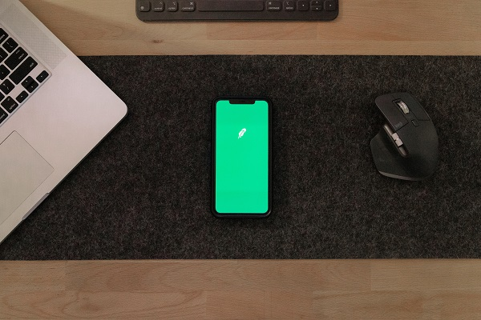

<!DOCTYPE html>
<html lang="en">
<head>
    <meta charset="UTF-8">
    <meta http-equiv="X-UA-Compatible" content="IE=edge">
    <meta name="viewport" content="width=device-width, initial-scale=1.0">
    <title>Portfolio</title>
    <link rel="stylesheet" href="styles/styles.css">
    <link rel="preconnect" href="https://fonts.googleapis.com">
    <link rel="preconnect" href="https://fonts.gstatic.com" crossorigin>
    <link rel="stylesheet" href="https://cdnjs.cloudflare.com/ajax/libs/font-awesome/5.15.4/css/all.min.css" integrity="sha512-1ycn6IcaQQ40/MKBW2W4Rhis/DbILU74C1vSrLJxCq57o941Ym01SwNsOMqvEBFlcgUa6xLiPY/NS5R+E6ztJQ==" crossorigin="anonymous" referrerpolicy="no-referrer" />
    <link href="https://fonts.googleapis.com/css2?family=Poppins:wght@400;500;600;700;800&display=swap" rel="stylesheet">
</head>

<body class="main-content">
    <header class="container header active" id="home">
        

            

                

                

                 
                

            

            

                <h2 class="name">
                    Hi, CURRICULUM VITAE OF  HABIBUR RAHMAN SHAIKH.
                    
                    
                </h2>
                <h3>Kamil Graduate in Fiqh with hands-on experience in IT Project Administration, Administrative Management, Documentation Control, and Team Leadership.</h3>
                

                  ⭐IT Expert ☕ Documentation & File Management  🚀 Reporting & Data Preparation 🎨 Team Coordination | ☁️ Meeting Arrangement & Follow-up  🎯Administrative Support & Operations Control
                

                

                    <a href="img/CURRICULUM VITAE 0.3.pdf" class="main-btn">
                        Download CV
                        <i class="fas fa-download"></i>
                    </a>
                

            

        

    </header>
    <main>
        <section class="container about" id="about">
            

                <h2>About memy stats</h2>
            

            

    

        <h4>Information About me</h4>
        
Motivated and detail-oriented professional with strong expertise in IT support, administration, accounting, digital marketing, and training. With over two years of diverse experience across various organizations, I have developed solid technical and managerial skills. I possess practical knowledge in computer science and IT operations, and I have successfully completed Kamil (Master’s equivalent) in Islamic Studies with a specialization in Fiqh. Skilled in IT infrastructure management, project coordination, administrative operations, and technical training, I am committed to continuous learning and innovation. I seek to contribute my abilities to a reputable organization that values teamwork, growth, and excellence, while advancing both organizational objectives and my professional development.

    

  

    

        
Leadership

        

           Student Organization & Social Leadership Various Roles from Local to District Level Duration: February 2014 – Present  
            • Held leadership positions in student organizations, managing activities and coordinating teams at district level.  
             • Engaged in social leadership and community mobilization initiatives.  
              • Facilitated training and development programs for youth members. Educational Management and Teaching Various Educational Institutions  
               • Managed and contributed to the administration of educational institutions.  
                • Delivered teaching and training sessions across different subjects and levels.  
                 • Developed curricula and learning materials tailored to student needs.
        

    

        
Educational Management and Teaching Various Educational Institutions

        

            • Managed and contributed to the administration of educational institutions.  
             • Delivered teaching and training sessions across different subjects and levels.  
              • Developed curricula and learning materials tailored to student needs.
        

    

    

        
Religious Leadership Experience

        

            Imam & Khatib at Local Mosque Duration: January 2017 – December 2022  
             • Led congregational prayers and delivered sermons (Khutbah).  
              • Provided religious guidance and counseling to community members.  
               • Organized religious events and educational sessions.
        

           

          
RESPONSIBILITIES...........................................                                                                            

           

             Arranging Data, Preparing Financial Statements.  
               Arrange monthly meeting, Staff coordination meeting.  
                Monitoring and follow up.  
                 Receiving and paying Chaque and cash from the customers.  
                  Reporting Monthly.  
                   Transaction with Bank and customer.  
                    Store management.
          
 
         

         
        

        

                <h2>ACADEMIC PROFILEACADEMIC PROFILE</h2>
            

    

        
       

<!-- Table 1 -->

<h2 class="edu-title">Master of Arts (MA) in Islamic Studies (Fiqh & Legal Studies)</h2>
<table>
<tr><td>Name of Institution</td><td>:</td><td>Govt. Madrasah-E-Alia, Dhaka</td></tr>
<tr><td>Year of Passing</td><td>:</td><td>2024</td></tr>
<tr><td>Subject</td><td>:</td><td>Fiqh & Legal Studies</td></tr>
<tr><td>Board</td><td>:</td><td>Islami Arabic University</td></tr>
<tr><td>Achievement</td><td>:</td><td>Result-seeking</td></tr>
<tr><td>Duration</td><td>:</td><td>Two Year</td></tr>
</table>

<!-- Table 2 -->

<h2 class="edu-title">BTIS (Bachelor of Theology and Islamic Studies) / Fazil</h2>
<table>
<tr><td>Name of Institution</td><td>:</td><td>Narail Islami Fazil Madrasah</td></tr>
<tr><td>Year of Passing</td><td>:</td><td>2024</td></tr>
<tr><td>Subject</td><td>:</td><td>Humanities</td></tr>
<tr><td>Board</td><td>:</td><td>Islami Arabic University</td></tr>
<tr><td>Achievement</td><td>:</td><td>Second Class</td></tr>
<tr><td>Duration</td><td>:</td><td>Three Year</td></tr>
</table>

<!-- Table 3 -->

<h2 class="edu-title">Higher Secondary Certificate (HSC) / ALIM</h2>
<table>
<tr><td>Name of Institution</td><td>:</td><td>Al-Jamiatu-Islamia Fazil Madrasah, Narail</td></tr>
<tr><td>Year of Passing</td><td>:</td><td>2019</td></tr>
<tr><td>Group</td><td>:</td><td>General</td></tr>
<tr><td>Board</td><td>:</td><td>Bangladesh Madrasah Education Board, Dhaka</td></tr>
<tr><td>Achievement</td><td>:</td><td>3.00</td></tr>
<tr><td>Duration</td><td>:</td><td>Two Years</td></tr>
</table>

<!-- Table 4 -->

<h2 class="edu-title">Secondary School Certificate (SSC) / Dakhil</h2>
<table>
<tr><td>Name of Institution</td><td>:</td><td>Amada Dakhil Madrasah, Lohagora, Narail</td></tr>
<tr><td>Year of Passing</td><td>:</td><td>2017</td></tr>
<tr><td>Group</td><td>:</td><td>General</td></tr>
<tr><td>Board</td><td>:</td><td>Bangladesh Madrasah Education Board, Dhaka</td></tr>
<tr><td>Achievement</td><td>:</td><td>3.80</td></tr>
<tr><td>Duration of Course</td><td>:</td><td>Ten Year</td></tr>
</table>

<h2 class="section-title">Training & Short Courses</h2>

<h3>Computer Office Application</h3>

<b>Institute:</b> TTC, Narail

<b>Topics Covered:</b> Microsoft Word (Bangla & English), Excel, Access, PowerPoint, Operating System, Internet

<b>Duration:</b> 6 Months (July 2019 – December 2019)

<h3>Graphic Design</h3>

<b>Institute:</b> Online (Self-paced)

<b>Topics Covered:</b> Figma, Adobe Photoshop, Adobe Illustrator

<b>Duration:</b> 4 Months (March 2019 – June 2019)

<h3>Digital Marketing</h3>

<b>Mentor:</b> Khalid Farhan

<b>Topics Covered:</b> SEO, Facebook Marketing, YouTube Marketing, Google Ads

<b>Duration:</b> Self-paced

<h3>Electronics</h3>

<b>Institute:</b> YTC, Narail

<b>Duration:</b> 6 Months (July 2019 – December 2019)

<h3>Refrigeration and Air Conditioning</h3>

<b>Institute:</b> YTC, Narail

<b>Duration:</b> 6 Months (July 2019 – December 2019)

<h3>Skill Development Training Camp</h3>

<b>Organizer:</b> CED Foundation

<b>Duration:</b> 5 Days (17 Nov 2022 – 21 Nov 2022)

<b>Focus Areas:</b> Leadership, Communication, Teamwork, Career Development

        
        

        

 

                <h2>My SkillsMy Skills</h2>
            

  

  <h2 class="skills-title">Skill Highlights:</h2>

  

    <!-- Skill 1 -->
    

      
Digital Marketing

      
SEO, Facebook Marketing, YouTube Marketing, Google Ads

      

        
          85%
        
      

    

    <!-- Skill 2 -->
    

      
Graphic Design

      
Adobe Photoshop, Adobe Illustrator, Adobe Animate

      

        
          90%
        
      

    

    <!-- Skill 3 -->
    

      
MS Word

      
Typing 30 WPM (English), 20 WPM (Bangla); Advanced formatting

      

        
          80%
        
      

    

    <!-- Skill 4 -->
    

      
MS Excel

      
Power BI, Macros, Pivot Tables, VLOOKUP, Charts

      

        
          85%
        
      

    

    <!-- Skill 5 -->
    

      
MS PowerPoint

      
Slide Master, Custom Layout, Advanced Animation & Hyperlinks

      

        
          80%
        
      

    

    <!-- Skill 6 -->
    

      
Web Development

      
HTML, CSS, JavaScript, Bootstrap

      

        
          75%
        
      

    

    <!-- Skill 7 -->
    

      
Operating System

      
Windows XP, 7, 10, 11

      

        
          80%
        
      

    

    <!-- Skill 8 -->
    

      
Administration Skills

      
Document Management, Reporting, Staff Support, Inventory Control

      

        
          75%
        
      

    

    <!-- Skill 9 -->
    

      
English Communication

      
Verbal & Written Communication Skills

      

        
          70%
        
      

    

    <!-- Skill 10 -->
    

      
Mobile App Development

      
Kotlin, Android Studio, UI Design

      

        
          75%
        
      

    

    <!-- Skill 11 -->
    

      
Java Programming

      
OOP, Java Swing, Collections, Threads

      

        
          95%
        
      

    

    <!-- Skill 12 -->
    

      
Python

      
Basic to Intermediate Scripting & Automation

      

        
          70%
        
      

    

    <!-- Skill 13 -->
    

      
PHP

      
Backend Development, Laravel, REST APIs

      

        
          70%
        
      

    

    <!-- Skill 14 -->
    

      
SQL / MySQL / NoSQL / SQLite

      
Database Design, Queries, Optimization

      

        
          75%
        
      

    

    <!-- Skill 15 -->
    

      
HTML, CSS, JS, jQuery, Bootstrap

      
Frontend Design, Layout & Styling

      

        
          75%
        
      

    

  

  <h2 class="section-title">Skill Certificates</h2>

  

    <h3>Computer Operation</h3>
    
<b>Institute:</b> TTC, Narail

    
<b>Duration:</b> 6 months (July 2019 – December 2019)

    
<b>Topics Covered:</b> Microsoft Word (Bengali & English), Excel, Access, PowerPoint, Operating System

  

  

    <h3>Driving Skill</h3>
    
Good driving skill on motorcycle and car

  

  

    <h3>Electronics</h3>
    
<b>Institute:</b> YTC, Narail

    
<b>Duration:</b> 6 months (July 2019 – December 2019)

    
<b>Topics Covered:</b> Basic Electronics Theory & Practice

  

  

    <h3>Refrigeration and Air Conditioning</h3>
    
<b>Institute:</b> YTC, Narail

    
<b>Duration:</b> 6 months (July 2019 – December 2019)

    
<b>Topics Covered:</b> Refrigeration Systems, Air Conditioning Maintenance

  

  <h2 class="section-title">Language Skills</h2>

  

    <h3>Bengali</h3>
    
Native, excellent (both written and conversation)

  

  

    <h3>English</h3>
    
Fluent (both written and conversation)

  

  

    <h3>Arabic</h3>
    
Fluent (both written and conversation)

  

  <h2 class="section-title">Personal Qualities</h2>

  

    

      <h3>Articulate Communicator</h3>
      
Able to convey ideas clearly and effectively to both technical and non-technical audiences.

    

    

      <h3>Team-Oriented Leader</h3>
      
Proven track record of successful collaboration and leadership in diverse, cross-functional teams.

    

    

      <h3>Analytical Problem-Solver</h3>
      
Strong reasoning skills to diagnose and resolve technical and strategic issues efficiently.

    

    

      <h3>Efficient Time Manager</h3>
      
Skilled at organizing tasks and consistently meeting deadlines in high-pressure environments.

    

    

      <h3>Highly Adaptable</h3>
      
Quick to learn and integrate new tools, technologies, and industry practices.

    

    

      <h3>Critical Thinker</h3>
      
Capable of in-depth analysis and sound decision-making under challenging circumstances.

    

    

      <h3>Mentorship & Training Expertise</h3>
      
Experienced in guiding junior team members and delivering IT and digital marketing training.

    

    

      <h3>Creative Strategist</h3>
      
Innovative thinker in campaign development, design execution, and complex problem-solving.

    

    

      <h3>Detail-Oriented</h3>
      
Focused on precision, quality control, and accurate documentation.

    

    

      <h3>Client-Focused Approach</h3>
      
Committed to providing solutions that align with client needs and expectations.

    

    

      <h3>Effective Educator</h3>
      
Adept in transferring knowledge clearly and engagingly through teaching and training.

    

    

      <h3>Culturally Sensitive Team Player</h3>
      
Able to thrive in multicultural work environments and perform well under pressure.

    

    

      <h3>Clear and Concise Expression</h3>
      
Skilled in articulating thoughts fluently, both in spoken and written forms.

    

    

      <h3>Engaged Volunteer</h3>
      
Actively involved in organizing and contributing to cultural and community programs.

    

  

  <h2 class="section-title">Extracurricular Activities</h2>

  

    

      🩸
      Voluntary Blood Donation
    

    

      🗣
      Debating & Public Speaking
    

    

      🌱
      Environmental Initiatives
    

    

      ✈️
      Educational & Cultural Travel
    

    

      🎉
      Event & Catering Management
    

    

      🍽
      Catering for Social & Religious Programs
    

  

                <h2>PERSONAL DETAILSPERSONAL DETAILS</h2>
            

    <h2 class="profile-table-title">Personal Details</h2>
    <table class="profile-table">
        <tr>
            <th>Field</th>
            <th>Details</th>
        </tr>
        <tr>
            <td>Father’s Name</td>
            <td>Md. Motiar Rahman</td>
        </tr>
        <tr>
            <td>Mother’s Name</td>
            <td>Mrs. Shahida Begum</td>
        </tr>
        <tr>
            <td>Permanent Address</td>
            <td>Vill: Amada, Post: Amada, Upazila: Lohagora, Narail, Bangladesh</td>
        </tr>
        <tr>
            <td>Date of Birth</td>
            <td>22 March 2001</td>
        </tr>
        <tr>
            <td>Marital Status</td>
            <td>Unmarried</td>
        </tr>
        <tr>
            <td>Nationality</td>
            <td>Bangladeshi (by birth)</td>
        </tr>
        <tr>
            <td>Religion</td>
            <td>Islam</td>
        </tr>
        <tr>
            <td>Gender</td>
            <td>Male</td>
        </tr>
        <tr>
            <td>Blood Group</td>
            <td>O+ (Positive)</td>
        </tr>
        <tr>
            <td>Email Address</td>
            <td>habiburrohoman08490@gmail.com</td>
        </tr>
    </table>

</body>
</html>

    <!-- Reference Card -->
    

        <h2 class="profile-card-title">Reference</h2>
        <table class="profile-card-table">
            <tr>
                <td>Name</td>
                <td>:</td>
                <td>Md. Shamsur Rahman</td>
            </tr>
            <tr>
                <td>Designation</td>
                <td>:</td>
                <td>Senior Administrative Officer</td>
            </tr>
            <tr>
                <td>Organization</td>
                <td>:</td>
                <td>Bangladesh Islami University</td>
            </tr>
            <tr>
                <td>Address</td>
                <td>:</td>
                <td>Gazaria Tower, 89/12 R.K. Mission Road, ManikNagor, Biswa Road, Dhaka</td>
            </tr>
            <tr>
                <td>Mobile</td>
                <td>:</td>
                <td>01915492008</td>
            </tr>
            <tr>
                <td>T&T</td>
                <td>:</td>
                <td>755249</td>
            </tr>
            <tr>
                <td>Relation</td>
                <td>:</td>
                <td>Industry Reference</td>
            </tr>
        </table>
    

    <!-- Hobbies & Interests Card -->
    

        <h2 class="profile-card-title">Hobbies & Interests</h2>
        <ul class="profile-card-list">
            <li>Traveling globally to explore diverse cultures and broaden perspectives.</li>
            <li>Gardening, especially designing and maintaining flower gardens, showcasing creativity and patience.</li>
        </ul>
    

<!-- Certification Card -->

    <h2 class="profile-card-title">Certification</h2>
    

        I hereby certify that, to the best of my knowledge and belief, the information provided in this resume accurately represents my qualifications, experience, and personal background. I fully understand that any deliberate falsification or misrepresentation may result in disqualification from employment or termination, if hired.
    

</body>

            
  

            
            

        </section>
        <section class="container" id="portfolio">
            

                <h2>My PortfolioMy Work</h2>
            

            

                Here is some of my work that I've done in various programming languages.
            

            

                

                    

                        
                    

                    

                        <h3>Income Tax Source</h3>
                        

                            <a href="https://github.com/saddamsaddam/IncomeTaxBd" class="icon">
                                <i class="fab fa-github"></i>
                            </a>
                            
                        

                    

                

                

                    

                        
                    

                    

                        <h3>Online Exam System </h3>
                        

                            <a href="https://github.com/saddamsaddam/OnlineExamSystem" class="icon">
                                <i class="fab fa-github"></i>
                            </a>
                           
                        

                    

                

                

                    

                        
                    

                    

                        <h3>Player Bidding System </h3>
                        

                            <a href="https://github.com/saddamsaddam/Player_bidding_system" class="icon">
                                <i class="fab fa-github"></i>
                            </a>
                            
                        

                    

                

                

                    

                        
                    

                    

                        <h3>Custom Linkedlist </h3>
                        

                            <a href="https://github.com/saddamsaddam/Custom-LinkedList" class="icon">
                                <i class="fab fa-github"></i>
                            </a>
                            
                        

                    

                

                

                    

                        
                    

                    

                        <h3>Database Engine </h3>
                        

                            <a href="https://github.com/saddamsaddam/DatabaseEngine" class="icon">
                                <i class="fab fa-github"></i>
                            </a>
                            
                        

                    

                

                

                    

                        
                    

                    

                        <h3>Booking System</h3>
                        

                            <a href="https://github.com/saddamsaddam/Booking-System" class="icon">
                                <i class="fab fa-github"></i>
                            </a>
                           
                        

                    

                

                

                    

                        
                    

                    

                        <h3>Tournament Source</h3>
                        

                            <a href="https://github.com/saddamsaddam/Tournament" class="icon">
                                <i class="fab fa-github"></i>
                            </a>
                            
                        

                    

                

                 

                    

                        
                    

                    

                        <h4>Socket & MapRreduced</h4>
                        

                            <a href="https://github.com/saddamsaddam/Socket_MapRreduced" class="icon">
                                <i class="fab fa-github"></i>
                            </a>
                            
                        

                    

                

                

                    

                        
                    

                    

                        <h3>Java programing</h3>
                        

                            <a href="https://github.com/saddamsaddam/Basic-Java-Programing" class="icon">
                                <i class="fab fa-github"></i>
                            </a>
                           
                        

                    

                

                

                    

                        
                    

                    

                        <h3>Thymeleaf </h3>
                        

                            <a href="https://github.com/saddamsaddam/Thymeleaf-For-loop" class="icon">
                                <i class="fab fa-github"></i>
                            </a>
                            
                        

                    

                

                

                    

                        
                    

                    

                        <h4>Google Gmail Authentication </h4>
                        

                            <a href="https://github.com/saddamsaddam/Google-Gmail-Authentication" class="icon">
                                <i class="fab fa-github"></i>
                            </a>
                            
                        

                    

                

                

                    

                        
                    

                    

                        <h3>Quiz </h3>
                        

                            <a href="https://github.com/saddamsaddam/quiz-by-javascript" class="icon">
                                <i class="fab fa-github"></i>
                            </a>
                            
                        

                    

                

                

                    

                        
                    

                    

                        <h4>Email Validation by jquery</h4>
                        

                            <a href="https://github.com/saddamsaddam/Email-validation-by-jquery" class="icon">
                                <i class="fab fa-github"></i>
                            </a>
                           
                        

                    

                

                

                    

                        
                    

                    

                        <h3>File Read Write</h3>
                        

                            <a href="https://github.com/saddamsaddam/file-read-write-by-java" class="icon">
                                <i class="fab fa-github"></i>
                            </a>
                            
                        

                    

                

                

                    

                        
                    

                    

                        <h3>Huffman Codding </h3>
                        

                            <a href="https://github.com/saddamsaddam/-Huffman-coding" class="icon">
                                <i class="fab fa-github"></i>
                            </a>
                            
                        

                    

                

            

        </section>
        <section class="container" id="blogs">
            

                

                    <h2>My BlogsMy Blogs</h2>
                

                

                    

                        
                        

                            <h4>
                                How to Create Your Own Website
                            </h4>
                            

                                When creating your website, define its purpose and audience clearly. Choose a user-friendly platform like WordPress, Wix, or Squarespace for easy design and content management. Prioritize mobile responsiveness and optimize for search engines to enhance user experience and visibility.
                            

                        

                    

                    

                        
                        

                            <h4>
                                How to Become an Expert in Web Design
                            </h4>
                            

                           To become a web design expert, master HTML, CSS, JavaScript, responsive design and user-centered principles. Stay current with trends, optimize performance and hone communication. Build a diverse portfolio, seek feedback and create standout, user-friendly websites.                            

                        

                    

                    

                        
                        

                            <h4>
                                Become a Web Designer in 10 Days
                            </h4>
                            

                               Becoming a web designer in just ten days is a challenging endeavor. Focus on mastering HTML, CSS and basic design principles early on. Although you won't achieve full expertise, this foundation will allow you to create basic websites and set the stage for ongoing learning and improvement.
                            

                        

                    

                
                

            

        </section>
        <section class="container contact" id="contact">
            

                

                    <h2>Contact MeContact</h2>
                

                

                    

                        <h4>Contact me here</h4>
                        

   

    <!-- Left Side: Contact Info + Social Icons -->
    

        <h2 class="contact-card-title">Contact Me</h2>
        

            Stay updated, collaborate, and engage in discussions. Reach out via Facebook, Twitter, GitHub, and YouTube to explore my work, share ideas, or simply say hello.
        

        

            

                <i class="fas fa-map-marker-alt"></i>
                

                    Location:
                    Dhaka, Bangladesh
                

            

            

                <i class="fas fa-envelope"></i>
                

                    Email:
                    habiburrohoman08490@gmail.com
                

            

            

                <i class="fas fa-user-graduate"></i>
                

                    Education:
                    Kamil Graduate in Fiqh
                

            

            

                <i class="fas fa-mobile-alt"></i>
                

                    Mobile:
                    +88 01963477673
                

            

            

                <i class="fas fa-globe-africa"></i>
                

                    Languages:
                    Bangla, English, Arabic
                

            

        

        <!-- Social Icons -->
        

            <a href="https://www.facebook.com/Hrshseike" target="_blank"><i class="fab fa-facebook-f"></i></a>
            <a href="https://www.linkedin.com/in/habibur-rahman-87280a324/" target="_blank"><i class="fab fa-linkedin"></i></a>
            <a href="https://github.com/HabiburRahmanshaikh" target="_blank"><i class="fab fa-github"></i></a>
            <a href="https://www.youtube.com/@HabiburRahman-pl1yk" target="_blank"><i class="fab fa-youtube"></i></a>
        

    

<h2 class="contact-title">Connect With Me</h2>

<form action="https://formsubmit.co/habiburrohoman08490@gmail.com" method="POST">

<input type="text" name="name" placeholder="Your Name" required>

<input type="email" name="email" placeholder="Your Email" required>

<input type="text" name="subject" placeholder="Subject">

<textarea name="message" placeholder="Type your message..." rows="8" required></textarea>

<input type="hidden" name="_captcha" value="false">
<input type="hidden" name="_subject" value="New Message From Portfolio">

<button type="submit" class="submit-btn">Send Message</button>

</form>

    
    <!-- Right Side: Contact Form + CV Download -->
    

        <form class="contact-form">
            

                
     

                
            

                <a href="img/CURRICULUM VITAE 0.3.pdf" class="main-btn">
                    Download CV
                    <i class="fas fa-download"></i>
                </a>
            

        </form>
    

                            

                        </form>
                    

                

            

        </section>
    </main>

    

        

            <i class="fas fa-home"></i>
        

        

            <i class="fas fa-user"></i>
        

        

            <i class="fas fa-briefcase"></i>
        

        

            <i class="far fa-newspaper"></i>
        

        

            <i class="fas fa-envelope-open"></i>
        

    

    

        <i class="fas fa-adjust"></i>
    

    
</body>
</html>
